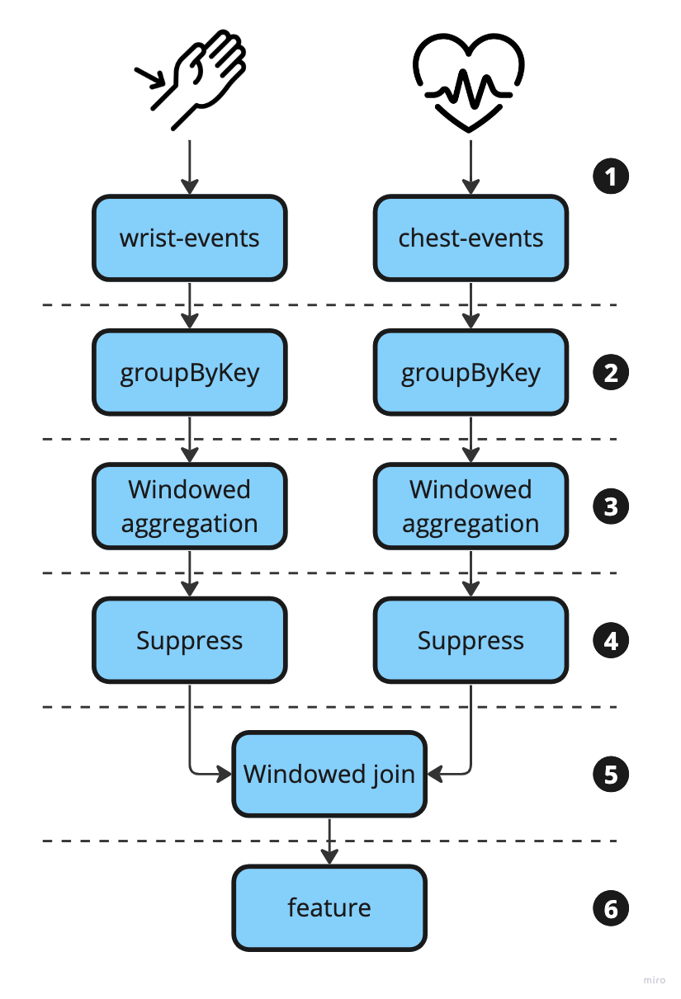

# Stream Topology

Our KafkaStreams topology can be abstracted as follows:

    

1. Our Kafka cluster contains two topics that capture users physiological data measurements.

    * The `wrist-events` topic is populated by a wrist sensor(E4). The sensor picks up data every one second. The data type can be checked in `model/WristDevice.java` directory.
    * The `chest-events` topic is populated by a chest sensor(RaspiBAN). The sensor picks up data every one second. The data type can be checked in `model/ChestDevice.java` directory.

2. For window processing, we need to group the records to Kafka Streams' prerequisite for performing aggregations.
3. We will user hopping window processing to convert series of raw data to feature data(statistic). Each sensor has different windowing size and overlap ratio.
4. We will user the `suppress` operator to only emit the final computation of each sensor window. After emitting windowed chunk data, we will calculate feature data (mean, standard deviation, min, max).
5. To apply ML model, we will perform a windowed join to combine the two sensor streams.
6. Finally, we will expose the results of our aggregation data from multiple device streams. We will write the output of our joined stream to a topic called `feature`.

# References

* Seymour, Mitch. [**_Matering Kafka Streams and ksqlDB_**](https://assets.confluent.io/m/7997a914c1a19b5). Oreilly, 2023.
* Bejeck Jr., William P. **_Kafka Streams in Action_**. Manning, 2019.
